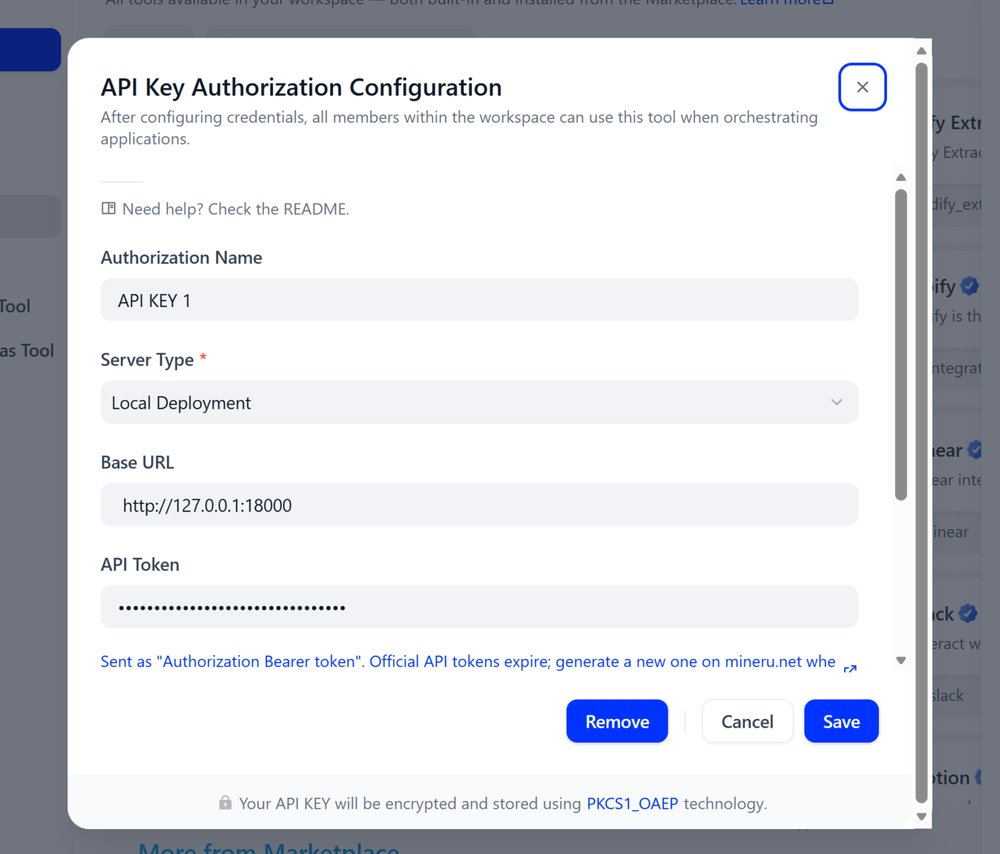
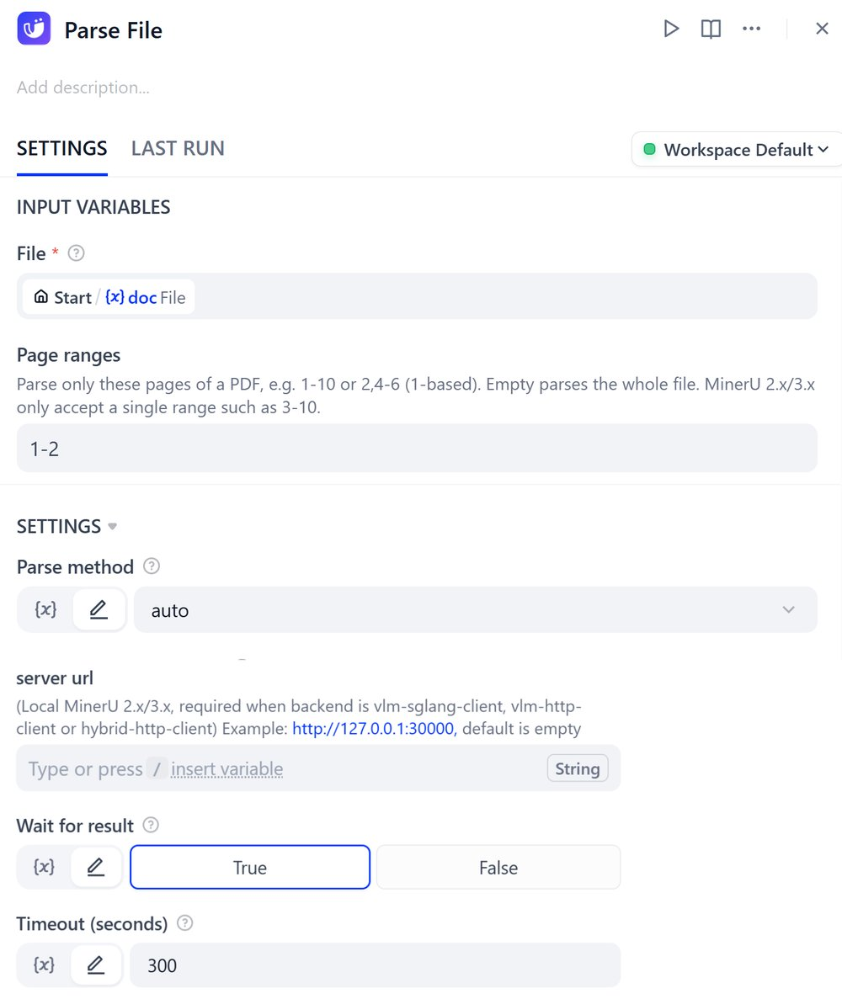
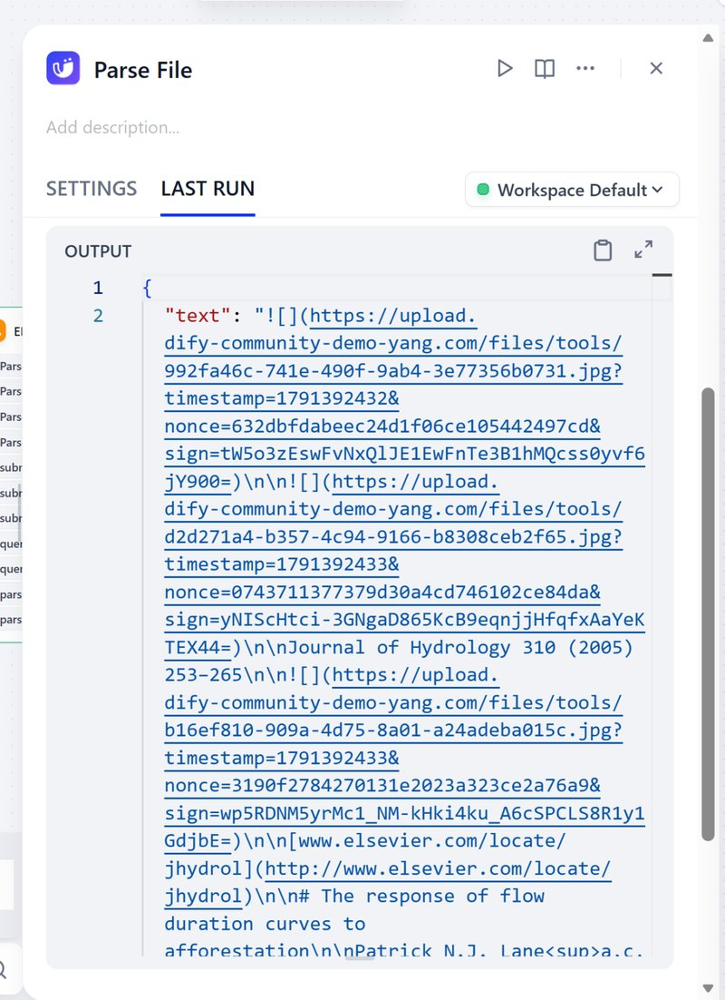
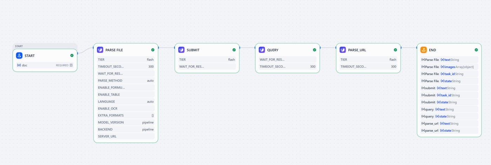

# MinerU Dify Plugin

## GitHub

MinerU is a tool that converts PDFs into machine-readable formats (e.g., markdown, JSON), allowing for easy extraction into any format.

MinerU is a document parser that can parse complex document data for any downstream LLM use case (RAG, agents)

[GitHub - opendatalab/MinerU: A high-quality tool for convert PDF to Markdown and JSON.](https://github.com/opendatalab/MinerU)

## Key Features

- Remove headers, footers, footnotes, page numbers, etc., to ensure semantic coherence.
- Output text in human-readable order, suitable for single-column, multi-column, and complex layouts.
- Preserve the structure of the original document, including headings, paragraphs, lists, etc.
- Extract images, image descriptions, tables, table titles, and footnotes.
- Automatically recognize and convert formulas in the document to LaTeX format.
- Automatically recognize and convert tables in the document to HTML format.
- Automatically detect scanned PDFs and garbled PDFs and enable OCR functionality.
- OCR supports detection and recognition of 84 languages.
- Supports multiple output formats, such as multimodal and NLP Markdown, JSON sorted by reading order, and rich intermediate formats.
- Supports various visualization results, including layout visualization and span visualization, for efficient confirmation of output quality.
- Supports running in a pure CPU environment, and also supports GPU(CUDA)/NPU(CANN)/MPS acceleration
- Compatible with Windows, Linux, and Mac platforms.

## What's New in 0.6.0

- **Self-hosted MinerU 4.x support.** MinerU 4.x replaced `/file_parse` with the V1 API (uploads → parse jobs → output files). The plugin detects the server version automatically, so the same configuration works with MinerU 1.x, 2.x, 3.x and 4.x, and you can upgrade the MinerU server without changing the plugin.
- **New tool: Parse URL** – let MinerU download and parse a document from an http(s) URL (official API and MinerU 4.x).
- **New tool: Get Parse Result** – fetch the status or result of a job by `task_id` / `batch_id`. Together with the new `Wait for result` and `Timeout` options of Parse File, long documents no longer have to finish within one tool call.
- **Page ranges** – parse only some pages of a PDF (e.g. `1-10`).
- **Gateway header** – optional fixed header (e.g. `X-API-Key`) for self-hosted MinerU behind a gateway or reverse proxy, sent in addition to the API token.
- **More file types** – xls/xlsx, more image formats, and html (official API `MinerU-HTML` model or MinerU 4.x).
- **Fixes for self-hosted MinerU 2.x/3.x** – the formula/table recognition switches and the document language are now actually sent to the server.
- New output variables `task_id`, `batch_id`, `state` and `server_type`; clearer error messages (expired token, quota, gateway or API-key rejections).
- Removed the unused "Replace Markdown Image Path" tool files; image links in the Markdown are replaced automatically.

## DEMO DSL

**You can download the YAML file and import it into Dify. This demo includes a basic capability demonstration of the plugin.**

[demo_dsl.yml](https://github.com/langgenius/dify-official-plugins/blob/main/tools/mineru/_assets/mineru_demo.yml)

## Tools

| Tool | What it does | Official API | Self-hosted 1.x–3.x | Self-hosted 4.x |
| --- | --- | :---: | :---: | :---: |
| Parse File (`parse-file`) | Parse an uploaded file | ✅ | ✅ (synchronous) | ✅ |
| Parse URL (`parse-url`) | Parse a document from an http(s) URL | ✅ | ❌ | ✅ |
| Get Parse Result (`get-parse-result`) | Status / result of a job by `task_id` or `batch_id` | ✅ | ❌ (no job ids) | ✅ |

## Configuration

Go to "Tools" → "Plugin Market", add the "MinerU" plugin and fill in its credentials. You can save several credentials (for example one for the official API and one for an internal server) and pick one per node.

| Field | Official API | Self-hosted |
| --- | --- | --- |
| Server Type | `MinerU Official API` | `Local Deployment` |
| Base URL | optional, defaults to `https://mineru.net` | required, e.g. `http://10.0.0.5:8000` |
| API Token | required – [get a token](https://mineru.net/apiManage/token). Tokens expire; generate a new one when you see "token has expired". | MinerU 4.x: only if the server was started with `--api-key`. Sent as `Authorization: Bearer <token>`. |
| Gateway Header Name / Value | not used | optional; a fixed header required by a gateway in front of MinerU |

Saving the credentials checks them with a read-only request.



**Network notes for self-hosted servers**

- Dify must be able to reach the Base URL. Do not use `127.0.0.1` or `localhost` unless MinerU runs on the same host as the Dify plugin daemon.
- Requests come from the Dify **plugin daemon**. If the gateway uses an IP allowlist, allow the plugin daemon's address.
- MinerU 2.x/3.x has no authentication of its own; keep it on an internal network or behind a gateway. For MinerU 4.x, start the server with `--api-key` when it listens on a non-loopback address.

### Starting a self-hosted server

- **MinerU 4.x**: `mineru-kit api-server --host 0.0.0.0 --port 8000 --tier standard --api-key <key>` (see the [MinerU HTTP API guide](https://github.com/opendatalab/MinerU/blob/master/docs/en/usage/http_api.md)). `flash` needs no models; `basic` runs on CPU; `standard`/`advanced` need a VLM.
- **MinerU 2.x/3.x**: `mineru-api --host 0.0.0.0 --port 8000`.

## Parse File / Parse URL parameters

| Parameter | Applies to | Description |
| --- | --- | --- |
| file / url | all | The document to parse. Parse URL: the official API only accepts public URLs; MinerU 4.x accepts https only unless started with `--allow-http-source`. |
| page_ranges | all | PDF pages to parse, 1-based, e.g. `1-10` or `2,4-6`. MinerU 2.x/3.x accept a single range such as `3-10`. |
| parse_method | self-hosted | `auto` / `ocr` / `txt` (MinerU 4.x: `ocr_mode`). |
| tier | self-hosted 4.x | `auto` (server default), `flash`, `basic`, `standard`, `advanced`. |
| enable_formula / enable_table | official API, self-hosted 2.x/3.x | Formula and table recognition. MinerU 4.x decides this from the tier. |
| language | official API, self-hosted 2.x/3.x | Document language, e.g. `ch`, `en`, `japan`. The official API accepts `auto`. |
| enable_ocr | official API | Force OCR. |
| extra_formats | official API | Extra exports, any of `["docx","html","latex"]`. Self-hosted MinerU 4.x only returns Markdown, JSON and images. |
| model_version | official API | `pipeline`, `vlm`, or `MinerU-HTML` for html files. |
| backend / server_url | self-hosted 2.x/3.x | Parsing backend; `server_url` is required for the `*-client` backends. |
| wait_for_result | official API, self-hosted 4.x | Wait until parsing finishes (default). If off, the tool returns a `task_id` / `batch_id` immediately. |
| timeout_seconds | all | How long to wait (default 540). Keep it below Dify's `PLUGIN_MAX_EXECUTION_TIMEOUT` (600 by default). If parsing is not finished in time, the tool returns the job id instead of failing. |



## Output Variables

| Output | Description |
| --- | --- |
| text | The parsed Markdown. Image links point to files stored in Dify. |
| json | Official API and MinerU 1.x–3.x: `content_list`. MinerU 4.x: `structured_content`. |
| files | Extra export formats (docx, html, latex) and images without a preview URL. |
| images | The images extracted from the document. |
| full_zip_url | Official API only: the zip of the complete result. |
| task_id / batch_id | The job id to pass to Get Parse Result (empty for MinerU 1.x–3.x). |
| state | `done`, or `pending` / `running` when the tool returned before parsing finished. Failed jobs raise an error. |
| server_type | `remote` (official API) or `local` (self-hosted). |



### Long documents

1. Run Parse File (or Parse URL) with `wait_for_result` off, or let it reach `timeout_seconds`.
2. Pass its `task_id` and `batch_id` outputs to Get Parse Result, e.g. inside a Loop node, until `state` is `done`.



Use the same credential for both tools – job ids only exist on the server that created them. A self-hosted MinerU 4.x server keeps jobs in memory, so job ids do not survive a server restart.

## Important: Dify Environment Configuration (`FILES_URL`)

To ensure the MinerU plugin can properly handle file uploads, you need to configure the `FILES_URL` setting in Dify:

1. Find your Dify deployment directory and edit the `.env` file.
2. Modify the `FILES_URL` configuration based on your deployment method:

   - **Docker Compose deployment**: Set `FILES_URL` to `http://api:5001`
   - **Other deployment methods**: Set `FILES_URL` to `http://DIFY_HOST_IP:5001` (e.g., `http://192.168.1.101:5001`, where the IP is usually the machine running Dify)
3. Confirm that the Dify API service's port `5001` is exposed externally (check port mapping in the `docker-compose.yaml` file).
4. After saving the `.env` file, restart the Dify service for the configuration to take effect:

   ```bash
   docker compose down
   docker compose up -d
   ```

> **Tips:**
>
> - If you use your local IP for the `FILES_URL`, your IP address may change when your network environment changes (e.g., connecting to a different WiFi). When this happens, you'll need to:
>
>   - Get your new local IP address
>   - Update the MinerU plugin's Base URL configuration in Dify
>   - If necessary (if Dify's `FILES_URL` is configured with an IP address rather than `api`), update Dify's `.env` file and restart the Dify service
> - When using the Dify MinerU plugin, especially when processing file uploads, if you don't configure this step, you may encounter errors like `Request URL is missing an 'http://' or 'https://' protocol`. This usually occurs because Dify's `api` service cannot correctly access its own file service.

## FAQs

1. **What should I do if I encounter the following error during execution?**

```text
Run failed: Failed to transform tool message: PluginInvokeError: {"args":{},"error_type":"Exception","message":"Error extracting page from PDF: Request URL is missing an 'http://' or 'https://' protocol."}
```

---


Please follow the instructions above to configure the settings accordingly, and this issue will be resolved.

https://github.com/langgenius/dify/issues/16327

2. **"This MinerU server cannot export the requested extra formats"** – self-hosted MinerU 4.x only returns Markdown, JSON and images. Leave Extra export formats empty.

3. **"The MinerU API token has expired"** – generate a new token at https://mineru.net/apiManage/token and update the plugin credentials.

## Credits

This plugin is powered by [MinerU](https://github.com/opendatalab/MinerU)
